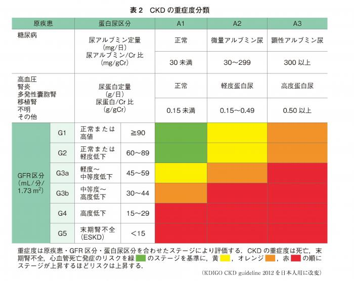

## CKD stage for Japanese people  

This table is quoted from *"JSN CKD guideline 2012"*.  
This guide line recommend Japanese formula to calculate eGFR.  

* reference  
[JSN CKD guideline 2013](https://cdn.jsn.or.jp/guideline/pdf/CKD_evidence2013/all.pdf)  
